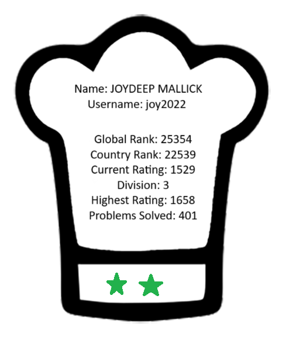

# CodeChef Readme Stats

Similar to what Codeforces Readme stats does. 

### Requirements
- requests
- BeautifulSoup
- drawsvg

As off now :-

1. `codechef_data_extractor.py` : uses BeautifulSoup to extract data from CodeChef profile static HTML page

2. `image_gen.py` : Uses Svg_write to generate an image

### How it will look on your system 
Assume user is **joy2022**

